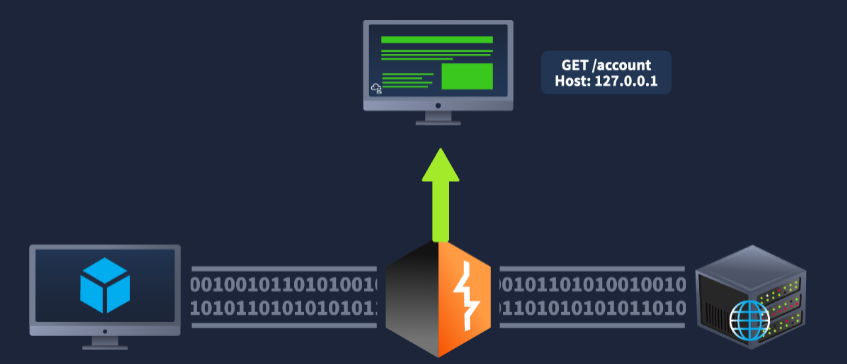
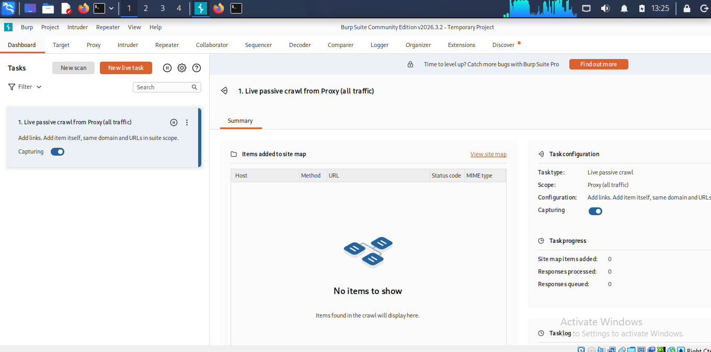
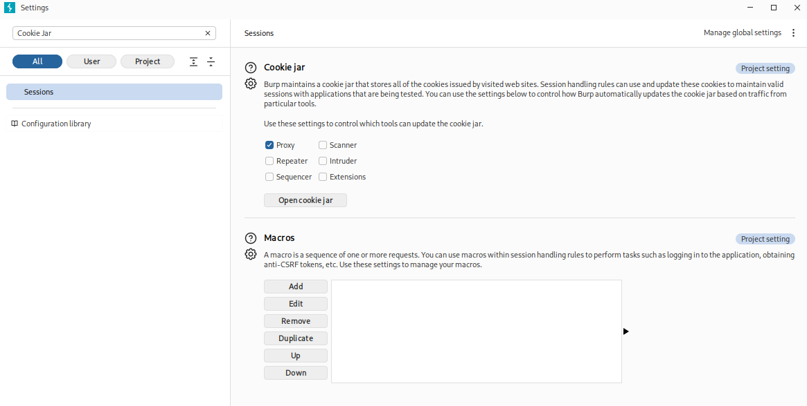
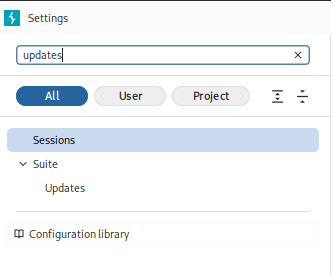
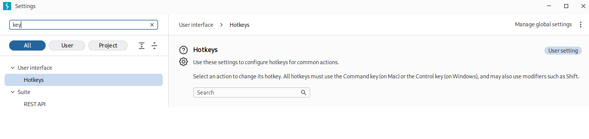
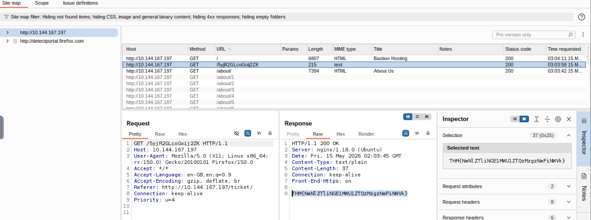
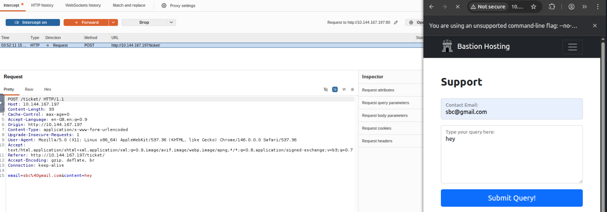
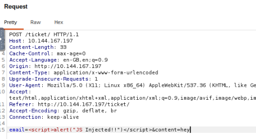
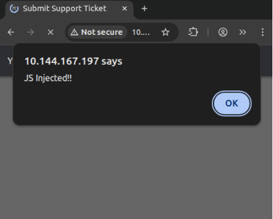

# Burp Suite: The Basics – TryHackMe Walkthrough

<div align="center">


</div>

---

## 📖 Room Overview



In this room, I explored the fundamentals of **Burp Suite** and learned how web application penetration testers intercept, inspect, and manipulate HTTP/HTTPS traffic.

Burp Suite acts as a **man-in-the-middle proxy** between the browser and the target server, allowing complete visibility into web requests and responses.

This room introduced:
- Proxy interception
- Request manipulation
- HTTPS interception
- Burp Browser
- Site mapping
- Scope management
- Web application testing workflows

---

# 🛠️ Task 1: Introduction

This task established the foundation for the room and explained why understanding Burp Suite’s interface and proxy workflow is essential before performing active testing.

## Key Takeaway for my GitHub

I learned that professional web application testing relies heavily on a structured workflow. Proper setup and understanding of the interface saves significant time during real assessments.

---

# 🌐 Task 2: What is Burp Suite?



Burp Suite is a Java-based framework used for web application penetration testing.

It captures and analyzes HTTP/HTTPS traffic between:
- Client (browser)
- Target web server

---

## Key Concepts

### 🔄 Proxy Interception

Burp Suite sits inline between the browser and the server, allowing:
- Request interception
- Response inspection
- Parameter modification
- Traffic manipulation

---

## Burp Suite Editions

| Edition | Purpose |
|---|---|
| Community | Free manual testing edition |
| Professional | Commercial edition with advanced tooling |
| Enterprise | Continuous automated vulnerability scanning |

---

## Questions & Answers

### Which edition of Burp Suite runs on a server and provides constant scanning for target web apps?

**Answer:** `Burp Suite Enterprise`

---

### Burp Suite is frequently used when attacking web applications and ______ applications.

**Answer:** `mobile`

---

# 🧩 Task 3: Features of Burp Community

This task explored the major modules included in Burp Suite Community Edition.

Even without automated scanning, the Community Edition provides powerful manual testing capabilities.

---

## Core Modules

| Tool | Purpose |
|---|---|
| Proxy | Intercepts HTTP/HTTPS traffic |
| Repeater | Resends and modifies requests |
| Intruder | Brute-forcing and fuzzing |
| Decoder | Encodes and decodes payloads |
| Comparer | Compares responses/data |
| Sequencer | Analyzes randomness of tokens |
| Extender | Adds third-party extensions |

---

## Security Perspective

Understanding these modules is important because web application testing often requires:
- Request tampering
- Parameter fuzzing
- Session analysis
- Manual exploitation

---

## Questions & Answers

### Which Burp Suite feature allows us to intercept requests between ourselves and the target?

**Answer:** `Proxy`

---

### Which Burp tool would we use to brute-force a login form?

**Answer:** `Intruder`

---

# 💻 Task 4: Installation

This section covered installing Burp Suite on multiple operating systems.

---

## What I Learned

### Kali Linux Advantage

Burp Suite Community Edition comes pre-installed on Kali Linux.

---

### Cross-Platform Support

Burp Suite supports:
- Windows
- macOS
- Linux

---

### Linux Installation Behavior

Installing without `sudo` places Burp Suite inside the user’s home directory.

Example:

```bash
~/BurpSuiteCommunity/
```

---

## Questions & Answers

### If you have chosen not to use the AttackBox, ensure that you have a copy of Burp Suite installed before proceeding.

**Answer:** `No answer needed`

---

# 🧭 Task 6: Navigation

This task focused on understanding Burp Suite’s interface layout and navigation system.

---

## Navigation Structure

### Main Tabs

The top menu switches between modules such as:
- Proxy
- Target
- Repeater
- Intruder

---

### Sub-Tabs

Each module contains additional sections.

Example:

```text
Proxy → Intercept → HTTP History → WebSockets History
```

---

## Useful Shortcuts

| Shortcut | Function |
|---|---|
| Ctrl + Shift + D | Dashboard |
| Ctrl + Shift + T | Target |
| Ctrl + Shift + P | Proxy |
| Ctrl + Shift + I | Intruder |
| Ctrl + Shift + R | Repeater |
---

## Questions & Answers

### Which tab Ctrl + Shift + P will switch us to?

**Answer:** `Proxy tab`

---

### In which category can you find a reference to a "Cookie jar"?

**Answer:** `Sessions`

---

### In which base category can you find the "Updates" sub-category, which controls the Burp Suite update behaviour?

**Answer:** `Suite`

---

### What is the name of the sub-category which allows you to change the keybindings for shortcuts in Burp Suite?

**Answer:** `Hotkeys`

---

### If we have uploaded Client-Side TLS certificates, can we override these on a per-project basis (yea/nay)?

**Answer:** `yea`

---
# ⚙️ Task 7: Options

This task focused on navigating and understanding the **Settings** menu in Burp Suite, which controls how the platform behaves.

Understanding the settings structure is important because Burp Suite is highly customizable, and proper configuration can significantly improve workflow efficiency during web application testing.

---

## 🌐 Global Settings vs. Project Settings

Burp Suite separates configurations into two main scopes:

| Setting Type | Description |
|---|---|
| Global Settings (User Settings) | Apply to the entire Burp Suite installation |
| Project Settings | Apply only to the currently active project/session |

---

### 🔹 Global Settings (User Settings)

These settings persist every time Burp Suite launches and define your default working environment.

Examples include:
- Display themes
- Hotkeys
- Update behavior
- UI preferences

---

### 🔹 Project Settings

These settings only affect the current session/project.

Examples include:
- Proxy behavior
- TLS certificates
- Scope configurations
- Session handling

---

## ⚠️ Important Note

Because **Burp Suite Community Edition** does not support saving project files, any project-specific configuration changes will be lost once the application is closed.

---

## 🧭 Navigating the Settings Menu

To access the settings menu:

1. Click the **Settings** button in the top navigation bar
2. A dedicated settings window will open

The left-side panel contains three major navigation elements.

---

## 🔍 Search

The search bar allows quick navigation to specific settings without manually browsing through every category.

This is extremely useful in Burp Suite because of the large number of available configuration options.

---

## 🏷️ Type Filter

The Type Filter allows filtering settings by scope:

- User settings
- Project settings

This makes it easier to identify whether a configuration persists globally or only for the current session.

---

## 📂 Categories

Burp organizes settings into structured categories such as:

- Suite
- Proxy
- Sessions
- Connections
- TLS
- Tools

This structure keeps advanced configurations manageable and organized.

---

## 💡 Pro-Tip

Many Burp modules include shortcut buttons that jump directly to their related settings category.

Example:
- The **Proxy** tab contains a direct shortcut to Proxy settings

This speeds up workflow navigation significantly during testing.

---

## Questions & Answers

### In which category can you find a reference to a "Cookie jar"?



**Answer:** `Sessions`

---

### In which base category can you find the "Updates" sub-category, which controls the Burp Suite update behaviour?



**Answer:** `Suite`

---

### What is the name of the sub-category which allows you to change the keybindings for shortcuts in Burp Suite?



**Answer:** `Hotkeys`

---

### If we have uploaded Client-Side TLS certificates, can we override these on a per-project basis (yea/nay)?

**Answer:** `yea`

---
# 🔍 Task 8: Introduction to the Burp Proxy

The Burp Proxy is the core component of Burp Suite.

It allows interception, inspection, and modification of web traffic.

---

## Key Concepts

### Interception

When interception is enabled:
- Requests pause before reaching the server
- Parameters can be modified manually
- Requests can be dropped or forwarded

---

### HTTP History

Burp stores all captured traffic for later analysis.

---

### Match and Replace

Burp can automatically modify requests using regex-based rules.

Examples:
- User-Agent spoofing
- Cookie replacement
- Header manipulation

---

## Questions & Answers

### Click me to proceed to the next task.

**Answer:** `No answer needed`

---

# 🌍 Task 9: Connecting Through the Proxy (FoxyProxy)

This task focused on configuring Firefox to send traffic through Burp Suite using FoxyProxy.

---

## Proxy Configuration

| Setting | Value |
|---|---|
| IP Address | 127.0.0.1 |
| Port | 8080 |

---

## What I Learned

### Why FoxyProxy Helps

Instead of manually changing browser network settings every time, FoxyProxy allows:
- Quick enable/disable
- Faster workflow management

---

### The “Hanging” Browser

When interception is ON:
- The browser appears frozen
- Burp is holding the request

This is expected behavior.

---

## Questions & Answers

### Click me to proceed to the next task.

**Answer:** `No answer needed`

---

# 🗺️ Task 10: Site Map and Issue Definitions

This task explored the Target tab and Burp’s site mapping functionality.

---

## Key Components

### Site Map

Displays:
- Pages
- APIs
- Endpoints
- Directories

in a tree structure.

---

### Issue Definitions

Provides explanations of vulnerabilities identified by Burp Scanner.

---

### Scope Settings

Allows filtering traffic to:
- Specific domains
- IP ranges
- Directories

---

## Questions & Answers

### What is the flag you receive after visiting the unusual endpoint?



**Answer:** `THM{NmNlZTliNGE1MWU1ZTQzMzgzNmFiNWVk}`

---

# 🌐 Task 11: The Burp Suite Browser

Burp includes a Chromium-based browser pre-configured for interception.

---

## Advantages of Burp Browser

### Zero Configuration

No need to:
- Configure external browser proxies
- Install certificates manually

---

### Integrated Workflow

The browser integrates directly with:
- Proxy
- Repeater
- HTTP History

---

### Sandbox Setting

When using the TryHackMe AttackBox as root:

```text
Settings → Tools → Burp's Browser
```

Enable:

```text
Allow Burp's browser to run without a sandbox
```

---

## Questions & Answers

### Click me to proceed to the next task.

**Answer:** `No answer needed`

---

# 🎯 Task 12: Scoping and Targeting

Scoping allows Burp Suite to focus only on authorized targets.

---

## Why Scoping Matters

Without scope filtering:
- Background browser traffic creates noise
- Workspace becomes cluttered
- Important requests become harder to identify

---

## Key Concepts

### Adding Targets to Scope

Fastest method:
1. Visit target
2. Right-click in Site Map
3. Select:

```text
Add to scope
```

---

### Intercept Filters

Burp can intercept:
- Only in-scope traffic
- Ignore unrelated requests

---

## Questions & Answers

### Add http://10.144.167.197/ to your scope and change the proxy settings to only intercept traffic to in-scope targets. See the difference between the amount of traffic getting caught by the proxy before and after limiting the scope.

**Answer:** `No answer needed`

---

# 🔐 Task 13: Proxying HTTPS

HTTPS interception requires trusting Burp Suite’s CA certificate.

Without this certificate:
- Browsers reject HTTPS traffic
- TLS interception fails

---

## Key Concepts

### Downloading the Certificate

Navigate to:

```text
http://burp/cert
```

---

### Importing into Browser

The certificate must be:
- Imported into browser settings
- Trusted for website identification

---

### AttackBox Advantage

The TryHackMe AttackBox already includes the PortSwigger CA certificate.

---

## Questions & Answers

### If you are not using the AttackBox, configure Firefox (or your browser of choice) to accept the PortSwigger CA certificate for TLS communication through the Burp Proxy.


**Answer:** `No answer needed`

---

# 💥 Task 14: My First Example Attack

This task demonstrated how Burp Suite can bypass client-side restrictions.

---

## The Scenario

Target page:

```text
http://10.144.167.197/ticket/
```

The application blocked special characters in the email field using client-side validation.

---


## How I Bypassed It

1. Enabled Burp interception
2. Submitted valid data
3. Captured the request
4. Modified the email parameter manually
5. URL-encoded the payload
6. Forwarded the request

---

## Security Lesson

> Client-side validation is not security.

If validation is not enforced server-side, attackers can bypass restrictions by modifying intercepted requests.



---




## Questions & Answers

### Click me to proceed to the next task.

**Answer:** `No answer needed`

---

# 🎓 Task 15: Conclusion

Completing this room gave me a strong foundation in web application interception and manual request manipulation using Burp Suite.

---

## Skills Learned

- Proxy interception
- HTTP/HTTPS analysis
- Request modification
- Site mapping
- Scope management
- HTTPS proxying
- Burp Browser usage
- Client-side validation bypass

---

## Final Reflection

> Burp Suite transforms the browser into a controllable testing platform. Understanding how traffic flows between a client and server is essential for discovering real-world web application vulnerabilities.

---

# 🧰 Tools Used

- Burp Suite Community Edition
- Firefox
- FoxyProxy
- TryHackMe AttackBox

---

# 👨‍💻 Author

**Sanjish K C**  
MS Cybersecurity Candidate at Webster University | Network Analysis | Nmap | Wireshark | Linux | Former Computer Science Instructor Transitioning into Cybersecurity
