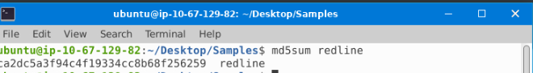
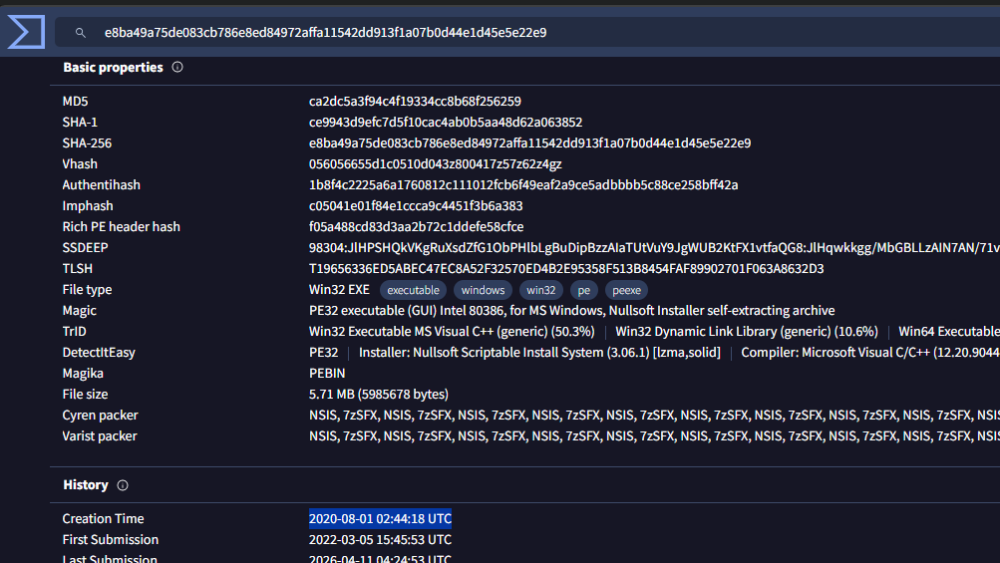
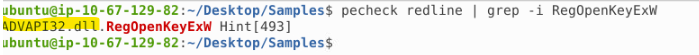
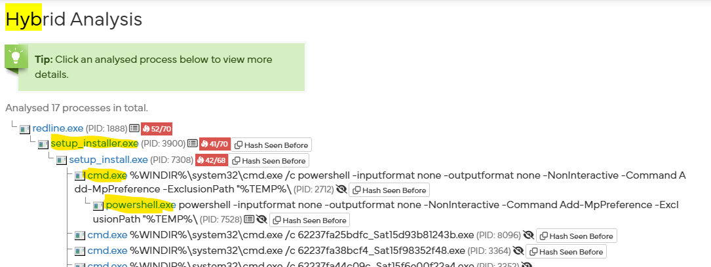

<div align="center">

# 🦠 Intro to Malware Analysis — TryHackMe Walkthrough


</div>

---

## 📖 Room Overview

This room is a beginner-friendly primer on what to do when you run into a suspected malware sample. It covers the two core pillars of malware analysis: static analysis (studying a file without running it) and dynamic analysis (running it in a controlled environment to watch its behaviour), and it introduces the tooling used for each.

Everything is done inside an attached Remnux VM (Reverse Engineering Malware Linux), a distro purpose-built for malware work with the tools pre-installed. The samples live in `~/Desktop/Samples`. WannaCry is used as the tutorial example, while the graded questions all revolve around a sample named redline.

By the end you'll have touched file typing, string extraction, hashing, VirusTotal lookups, PE header inspection with pecheck, sandbox concepts, a real Hybrid Analysis report, and the anti-analysis tricks malware authors use to fight back.

---

# 📝 Task 1: Introduction

A short intro that frames the room. No questions here. It just sets the stage for why analysts need a repeatable process when a suspicious file lands on their desk.

---

# 🧩 Task 2: Malware Analysis

Another reading task. It explains that malware analysis is a lot like reassembling a puzzle: you gather clues from different tools and stitch them together into a picture of what the malware actually does. The most common artefact you'll deal with is a PE file (Portable Executable), but you may also run into malicious documents or packet captures.

---

# ⚙️ Task 3: Techniques of Malware Analysis

## Concept

There are two broad approaches to picking a sample apart:

| Technique | What it Means | Example Activities |
|-----------|---------------|--------------------|
| Static Analysis | Examining a file without executing it to understand its structure, behavior, and indicators. | Extracting and analyzing strings; inspecting the PE (Portable Executable) header; disassembling code using tools like IDA Pro or Ghidra; reviewing metadata and file hashes |
| Dynamic Analysis | Executing the file in a controlled and isolated environment to observe its runtime behavior. | Running the sample in a VM or sandbox; monitoring running processes; observing network traffic and connections; tracking file system, registry, and process changes |

Static analysis is quick and safe, but malware often hides its properties with obfuscation and packing. That's where dynamic analysis earns its keep, though malware also tries to detect the lab environment and behave innocently if it thinks it's being watched. Anything beyond this, like disassemblers and debuggers, is considered advanced analysis and is saved for a later module.

## ❓ Questions & Answers

Q1: Which technique is used for analyzing malware without executing it?

Static analysis

> How I got the answer: Static analysis is, by definition, inspecting a file's properties without executing it, such as reading strings or the PE header. This comes straight from the task text.

Q2: Which technique is used for analyzing malware by executing it and observing its behavior in a controlled environment?

Dynamic analysis

> How I got the answer: Dynamic analysis runs the sample in a sandbox or VM and observes runtime behaviour, which is exactly what the question describes.

---

# 🔍 Task 4: Basic Static Analysis

## Concept

Basic static analysis is about sizing up the malware before diving deep. Three staple moves:

- file reveals the true file type regardless of a misleading extension.
- strings dumps readable text, where API names or URLs can hint at behaviour.
- Hashing (md5sum, sha1sum, sha256sum) produces a unique fingerprint. A single changed bit changes the whole hash, so it's a reliable identifier for sharing or searching online (for example on VirusTotal). Best practice is to search the hash rather than upload the sample, so you don't leak anything sensitive.

## Commands

```bash
cd ~/Desktop/Samples
file redline
strings redline | less
md5sum redline
```

Then take the resulting MD5 and search it on VirusTotal, and open the Details tab to read metadata like the creation time.

## ❓ Questions & Answers

Q1: What is the md5sum of the redline sample?

ca2dc5a3f94c4f19334cc8b68f256259

> How I got the answer: I ran md5sum redline inside ~/Desktop/Samples. The command computes the MD5 fingerprint of the file and prints it next to the filename.



Q2: What is the creation time of this sample?

2020-08-01 02:44:18 UTC

> How I got the answer: I searched the MD5 hash on VirusTotal and opened the Details tab. The "Creation Time" field in the History section shows the compilation timestamp.



---

# 🧱 Task 5: The PE File Header

## Concept

The PE header is the metadata block at the front of a Portable Executable. Two parts matter most for triage:

- Imports/Exports are the functions the file borrows from the OS. Imports are a big behavioural tell: InternetOpen means it talks to the network, URLDownloadToFile means it downloads something, and RegOpenKeyExW means it touches the registry.
- Sections are the named regions the file is split into, each with a purpose:

| Section | Purpose |
|---------|---------|
| .text | Contains the executable machine code (CPU instructions) that the operating system executes. |
| .data | Stores initialized global and static variables that can be modified during program execution. |
| .rdata | Contains read-only data such as constant strings, import tables, and other immutable information. |
| .rsrc | Stores application resources, including icons, images, dialogs, menus, version information, and other embedded assets. |

The pecheck utility on Remnux dumps the hashes, per-section entropy (high entropy usually means compressed, encrypted, or packed), section names, and the import descriptors.

## Commands

```bash
pecheck redline                          # full header dump: sections + entropy
pecheck redline | grep -i RegOpenKeyExW  # locate the DLL for a specific import
pe-tree redline                          # GUI view of the same structure
```

## ❓ Questions & Answers

Q1: What is the entropy of the .text section of this sample?

6.453919

> How I got the answer: In the pecheck redline output, each section lists its entropy on a 0 to 8 scale. I read the value on the .text entropy line.

Q2: The sample has five sections (.text, .rdata, .data, .rsrc + one more). What is the fifth section?

.ndata

> How I got the answer: The pecheck section list showed a fifth entry beyond the four standard ones, .ndata, which is typical of NSIS-packed installers.

Q3: From which dll file does the sample import the RegOpenKeyExW function?

ADVAPI32.dll



> How I got the answer: In the import descriptors, RegOpenKeyExW (a registry API) is listed under ADVAPI32.dll, the Windows library that provides registry and security functions. I confirmed it with pecheck redline | grep -i RegOpenKeyExW.

Q4: Explore the sample with the GUI pe-tree tool.

No answer needed

> How I got the answer: I ran pe-tree redline and browsed the tree view (it takes a moment to launch). This one just needs you to click Check after exploring.

---

# 🏖️ Task 6: Basic Dynamic Analysis

## Concept

Dynamic analysis runs the sample and watches it, but only in an isolated lab you can snapshot and revert. The workhorse here is the sandbox: an environment that mimics the real target, wired up with OS monitors (Procmon, ProcExplorer, Regshot), network monitors (Wireshark, tcpdump), and controlled DNS/web services.

| Sandbox | Notes |
|---------|-------|
| Cuckoo | Classic, huge community, but archived and Python 2 only now |
| CAPE | More advanced Cuckoo successor, supports unpacking, Python 3, actively developed |
| Online (Any.run, Hybrid Analysis, Intezer) | Convenient, but search the hash rather than upload |

For this task we look up the redline hash on Hybrid Analysis and read the existing report's process tree.

## Steps

Go to Hybrid Analysis, search the redline MD5 hash, open a report, then inspect the process tree and behaviour.

## ❓ Questions & Answers

Q1: In the process tree, which is the first process launched by the sample?

setup_installer.exe

> How I got the answer: In the Hybrid Analysis report's process tree, the first spawned process was setup_installer.exe, which lines up with redline being delivered as a bundled installer.



Q2: There are two Windows utilities abused by the malware. What are their names?

cmd.exe and powershell.exe

> How I got the answer: Working down the process tree, the sample abuses two legitimate built-in Windows tools, cmd.exe and powershell.exe. This is a classic living-off-the-land pattern for running follow-on commands.

---

# 🛡️ Task 7: Anti-Analysis Techniques

## Concept

While analysts build tools, malware authors build countermeasures.

Packing & Obfuscation: a packer compresses or encrypts the file, so a strings search returns mostly garbage and the imports are hidden. Tell-tale signs from pecheck include very high entropy, a missing .text section, and sections that are writable and executable at the same time. The room's example is the zmsuz3pinwl sample.

Sandbox evasion: tricks to avoid being caught in an automated lab:

| Evasion trick | How it works |
|---------------|--------------|
| Long sleep calls | Stall past the sandbox's limited run time |
| User activity detection | Wait for mouse/keyboard input a bot won't produce |
| Footprinting user activity | Check for browsing/Office history and quit if the box looks unused |
| VM/driver detection | Spot VMware/VirtualBox artefacts and bail out |

## ❓ Questions & Answers

Q1: Which technique is used to bypass static analysis?

packing

> How I got the answer: Packing compresses or encrypts the sample so strings and imports can't be read statically, which directly defeats static analysis. The room demonstrates this with strings and pecheck on the packed sample.


Q2: Which technique is used to time out a sandbox?

long sleep calls

> How I got the answer: Sandboxes only run for a limited window, so long sleep calls delay any malicious activity until the sandbox gives up and stops recording.

---

# ✅ Task 8: Conclusion

A wrap-up that recaps static vs dynamic analysis, strings, hashes, and AV scans, the PE header, sandboxing, and anti-analysis evasion, with a promise of a deeper malware-analysis module to come.

Answer: No answer needed

---

## 🧰 Tools Used

| Tool | Purpose |
|------|---------|
| file | Identify true file type independent of extension |
| strings | Extract readable text and API/library clues |
| md5sum / sha1sum / sha256sum | Compute file hashes (unique fingerprints) |
| VirusTotal | Hash lookup, AV verdicts, sample metadata |
| pecheck | Inspect PE header for sections, entropy, imports |
| pe-tree | GUI-based PE structure explorer |
| Hybrid Analysis | Online sandbox for process tree and behaviour report |
| Remnux | Purpose-built malware-analysis Linux distro |

---

## 👨‍💻 Author

**Sanjish K C**

MS Cybersecurity Candidate at Webster University | Network Analysis | Nmap | Wireshark | Linux | Former Computer Science Instructor Transitioning into Cybersecurity
