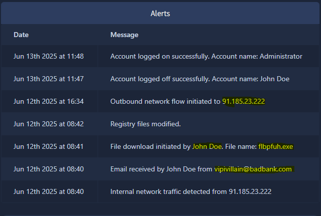
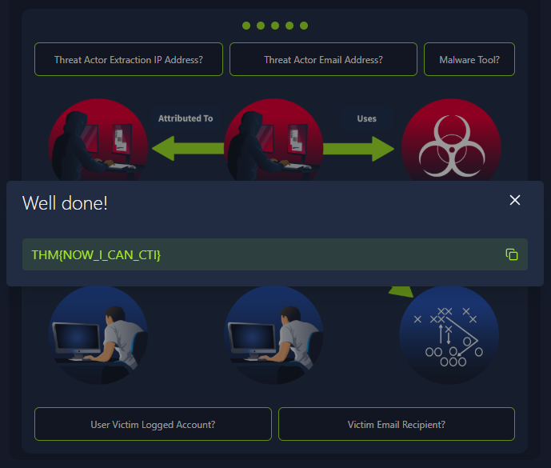

#  🕵️Intro to Cyber Threat Intel

## 📖 Room Overview

This room takes Cyber Threat Intelligence, which can feel like an abstract, high level discipline, and grounds it in the everyday work of a SOC Level 1 analyst. The idea running through it is simple: an analyst who can look at an indicator and say why it matters is far more useful than one who can only say what it is. It walks through what threat intelligence actually is, the lifecycle that turns raw data into something you can act on, the sources and formats that intel travels in, and the standards and frameworks that let analysts, vendors, and auditors all speak the same language.

The first four tasks are reading heavy and build the vocabulary. The last task is where it clicks into place: you open a small static site, read an alert feed the way you would on shift, and reconstruct a phishing attack into a threat profile to reveal the flag. It is an easy room, but the practical does a nice job of showing how the theory maps onto a real triage flow.

There is no attack box to deploy and no shell commands to run here. Everything happens either in the task text or inside the browser based static site in Task 5.

# 🚀 Task 1: Introduction

The room opens by framing why CTI belongs on the L1 analyst's desk and not just with dedicated intel specialists. A modern SOC is noisy, alerts never stop arriving, and the analyst is the first human to look at each one. The goal it sets is to move you from "I recognise an IP address" to "I recognise why this IP address spells trouble, and I can prove it." It also lists the three learning objectives: understanding what threat intelligence is and why it matters, learning the intelligence lifecycle and the indicators to watch, and getting familiar with sharing intel through feeds and platforms.

**Ready to get started!**
No answer needed
> This is a click to continue prompt with no input field, so the platform marks it correct on its own once you move on.

# 🧠 Task 2: Cyber Threat Intelligence

This task explains the value CTI adds during triage: context. Faced with two hundred alerts, an analyst needs to know who is on the other end of an indicator, how they have behaved before, and what to do about it right now. To get there, the room separates three ideas that people often blur together. Data is a raw observable like an IP and port. Information is that data plus factual annotation, such as who the IP is registered to. Intelligence is analysed information that answers the "so what," for example that the IP belongs to an active C2 and should be blocked. Pushing an artefact up that ladder is called enrichment.

It also introduces three labels you will use constantly, and the four classifications of intel.

| Term | Meaning | Example |
|------|---------|---------|
| IOC (Indicator of Compromise) | Evidence a breach has happened | A C2 address showing up in the logs |
| IOA (Indicator of Attack) | A malicious action in progress | PowerShell launching an unknown service |
| TTP (Tactics, Techniques, Procedures) | An adversary's methods, mapped to ATT&CK IDs | T1059.001 PowerShell abuse |

| Classification | Focus | Example |
|----------------|-------|---------|
| Strategic | High level risk and trends for business decisions | Annual ransomware trends report |
| Tactical | Adversary behaviours and TTPs | Advisory on new T1059.005 abuse in malspam |
| Operational | Campaign specific motive and intent | Which internal assets a campaign targets |
| Technical | Atomic indicators and artefacts | IP addresses and file hashes |

**What does CTI stand for?**
Cyber Threat Intelligence
> CTI is the abbreviation the whole room is built around, spelled out in the task title and the opening objectives.

**IP addresses, Hashes and other threat artefacts would be found under which Threat Intelligence classification?**
Technical Intel
> Of the four classifications, technical intel is the one defined as atomic indicators and artefacts, and IPs and hashes are the textbook examples of those.

# 🔄 Task 3: CTI Lifecycle

CTI is not a one off lookup, it is a repeating cycle of six phases. The room tells it as a story: an analyst named Alex is asked to bring threat intelligence into the defence of a PostgreSQL production database. Following that narrative makes each phase concrete rather than a bullet on a slide.

| Phase | What happens in it |
|-------|--------------------|
| Direction | Set the mission and define the intelligence questions to answer |
| Collection | Gather raw indicators from feeds, OSINT, internal platforms, and reports |
| Processing | Normalise, correlate, and deduplicate the data into usable action files |
| Analysis | Judge relevance and confidence, and decide block, alert, or monitor |
| Dissemination | Deliver tailored output to firewall, endpoint, platform, and management |
| Feedback | Measure results with KPIs and refine the next iteration |

The task also introduces the Traffic Light Protocol (TLP CLEAR, GREEN, AMBER, RED) for controlling how widely intel can be shared, and mentions STIX as the JSON schema used to describe threat information in a machine readable form. A useful detail from the story: when the same indicator carries two different TLP labels, the stricter one wins, so an AMBER and a CLEAR tag combine to AMBER.

**At which phase of the CTI lifecycle is data converted into usable formats through sorting, organising, correlation and presentation?**
Processing
> Processing is the phase defined by normalising and correlating raw feeds into standardised, ready to use output, which matches the sorting and organising described in the question.

**During which phase do security analysts get the chance to define the questions to investigate incidents?**
Direction
> Direction is the opening phase where Alex sits with the CTI lead and turns a broad mandate into the specific questions Q1 and Q2 that steer the rest of the cycle.

# 🧩 Task 4: CTI Standards & Frameworks

Standards and frameworks give everyone a shared vocabulary so intel means the same thing across teams and vendors. The room covers the main ones an L1 analyst runs into. MITRE ATT&CK is the catalogue of how adversaries attack, giving each behaviour a technique ID you can drop into a triage note. MITRE D3FEND is the defender's mirror of that, mapping attacker techniques to concrete countermeasures. The Lockheed Martin Cyber Kill Chain breaks an intrusion into ordered stages so you can say where in the attack an activity sits. Vulnerability handling gets its own trio: CVE numbers identify a flaw, CVSS scores its severity, and the NVD ties those together. Finally, STIX and TAXII cover sharing, where STIX is the format and TAXII is the transport.

| Kill Chain phase | Purpose | Examples |
|------------------|---------|----------|
| Reconnaissance | Gather information about the victim | Email harvesting, OSINT, network scans |
| Weaponisation | Build the malware for the intended attack | Backdoored exploit, malicious Office document |
| Delivery | Get the malware to the victim | Email, weblinks, USB |
| Exploitation | Execute code by abusing a vulnerability | EternalBlue, ZeroLogon |
| Installation | Plant malware and tooling for access | Backdoors, remote access trojans |
| Command & Control | Remotely operate the compromised host | Empire, Cobalt Strike |
| Actions on Objectives | Achieve the attack's goal | Data exfiltration, ransomware, defacement |

For sharing, TAXII defines two models: Collection, where intel is hosted by a producer and pulled by consumers, and Channel, where intel is pushed out to users from a central server.

**What sharing models are supported by TAXII?**
Collection and Channel
> The task spells out both TAXII models directly, one pull based (Collection) and one push based (Channel).

**When an adversary has obtained access to a network and is extracting data, what phase of the kill chain are they on?**
Actions on Objectives
> Data exfiltration is listed as an example under Actions on Objectives, the final kill chain phase where the attacker carries out their actual goal.

# 🕵️ Task 5: Practical Analysis

This is where the theory turns into a triage exercise. The task explains that intel is often disseminated through published threat reports from vendors like Mandiant and Palo Alto Unit42, then hands you a static site to work through. You open it with the green **View Site** button, read the security monitoring tool on the right panel, and use what you see to fill in a threat profile. Building that profile correctly maps out the adversary and reveals the flag.

The right panel is an Alerts feed. Reading it in time order tells the whole story of the intrusion.

Walking the timeline from the bottom up: John Doe receives an email from `vipivillain@badbank.com`, internal traffic is seen from `91.185.23.222`, John Doe downloads a file named `flbpfuh.exe`, the registry is modified, an outbound network flow goes back out to `91.185.23.222`, and finally the Administrator account logs on while John Doe logs off. That is a clean phishing to download to persistence to exfiltration to privilege escalation chain, and each value drops straight into a profile field.

Filling the profile in with the extraction IP, the actor email, the malware tool, the victim's logged account, and the victim email recipient completes the picture and pops the flag.

For reference, the supporting profile values pulled from the alerts are the extraction IP `91.185.23.222`, the victim logged account `Administrator`, and the victim email recipient `John Doe`. The three graded questions below are the ones the room actually asks.

**What was the source email address?**
vipivillain@badbank.com
> The earliest alert in the feed shows John Doe receiving an email from this address, which is the origin of the whole phishing chain.

**What was the name of the file downloaded?**
flbpfuh.exe
> The feed records a file download initiated by John Doe right after the phishing email, and this is the executable that was pulled down.

**After building the threat profile, what message do you receive?**
THM{NOW_I_CAN_CTI}
> Once every profile field is filled correctly, the site returns a "Well done!" panel containing this flag, confirming the adversary was mapped out end to end.

## 🧰 Tools Used

| Tool | Purpose in this room |
|------|----------------------|
| Static Site Lab | Browser based alert feed used to reconstruct the attack in Task 5 |
| Cyber Kill Chain | Framework for placing each observed action into an attack phase |
| MITRE ATT&CK | Reference for labelling adversary techniques during triage |
| TLP | Scheme for deciding how widely each indicator can be shared |
| STIX / TAXII | Standards for formatting and exchanging threat intelligence |

## 👨‍💻 Author

Sanjish K C
CompTIA Security+ | MS Cybersecurity Candidate at Webster University | Network Analysis | Nmap | Wireshark | Linux | Former Computer Science Instructor Transitioning into Cybersecurity
