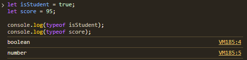
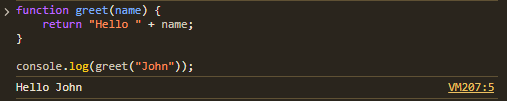
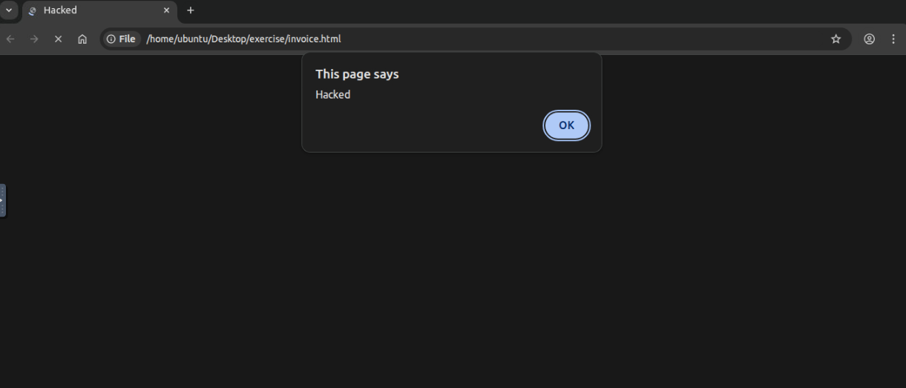
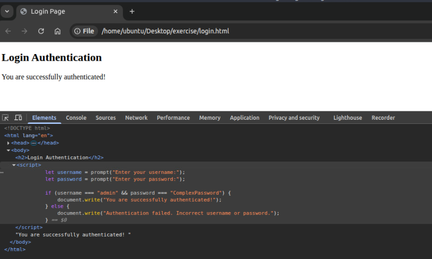
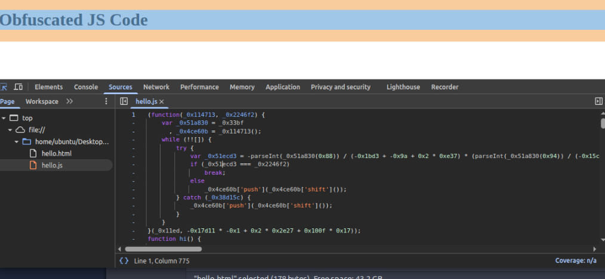
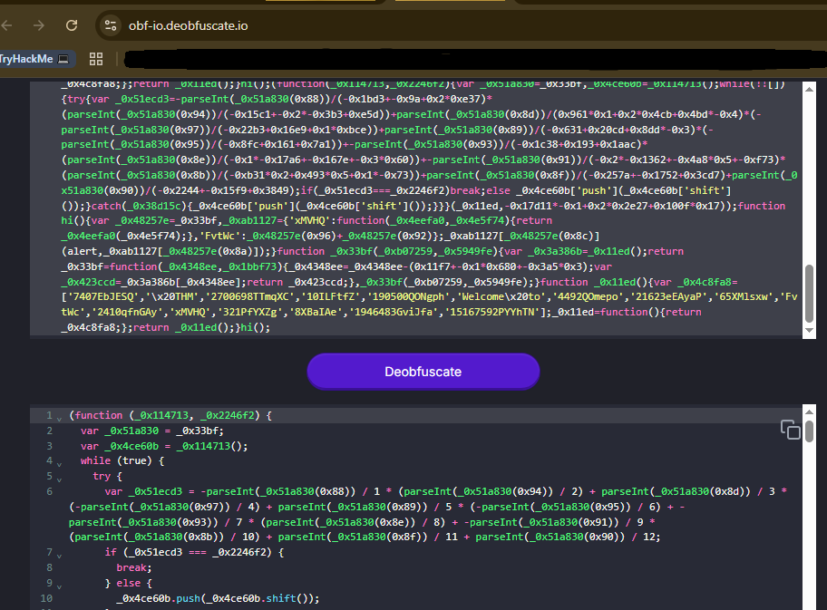

# JavaScript Essentials – TryHackMe Walkthrough

<div align="center">


</div>

---

## 📖 Room Overview

In this room, I learned the fundamentals of JavaScript and explored how client-side logic can impact web security.

JavaScript acts as the **brain of a website**:
- **HTML** provides structure
- **CSS** provides styling
- **JavaScript** provides interactivity and logic

This room helped me understand how attackers can inspect and manipulate browser-side logic using developer tools.

---

# 🛠️ Task 1: Introduction to JavaScript Essentials

In this section of the JavaScript Essentials room, I learned that JavaScript is the "brain" of a website. While HTML builds the structure and CSS handles the look, JS manages the interactivity.

## Key Takeaway for my GitHub
I realized that understanding JS isn't just for developers; it's vital for security. If I can understand how a site processes data on the client-side (in my browser), I can find ways to manipulate that logic.


---

# 🧠 Task 2: Essential Concepts

This task is all about the building blocks. To hack or build, you have to speak the language.

I focused on these four pillars:

---

## 1. Variables (Storing Data)

Think of variables as labeled boxes. I practiced using:

- `let`
- `const`
- `var`

### Why it matters
In security, we look for sensitive data like:
- API keys
- Session tokens
- Secrets accidentally left in global variables



---

## 2. Data Types

I explored how JavaScript handles different information:

- **Strings:** Text like `"Hello World"`
- **Numbers:** Integers or decimals
- **Booleans:** `true` or `false`
- **Arrays & Objects:** Ways JavaScript groups complex data

---

## 3. Functions

Functions are mini-programs that run when called.

```javascript
function greetMe() {
  console.log("Hello, Hacker!");
}
```



---

## 4. Conditionals (The Logic Gate)

Using:
- `if`
- `else if`
- `else`

to make decisions.

### Security Angle
This is where Task 6 gets interesting later. If the code says:

```javascript
if (admin == true)
```

I want to find a way to make that box say true even if I'm a guest.


---

# 🚀 Task 3: JavaScript Overview

In this task, I finally got my hands dirty by running my first program.

The most important lesson here is that JavaScript is an **interpreted language**.

Unlike languages like C++ or Java, there is no compilation step—the browser reads the code and executes it on the fly.

---

## The Chrome Console: My New Lab

I learned that I don't need a fancy setup to code; the Google Chrome Console is a fully functional playground.

By pressing:

```bash
Ctrl + Shift + I
```

I unlocked the ability to interact with any website's logic.

---

## What I practiced

```javascript
let x = 10;
let y = 10;
let result = x + y;
console.log("The result is: " + result);
```

When I changed x to 10, the output immediately updated to 20.

This real-time feedback is why JS is powerful for building and testing web apps.

---

### Key Concepts Captured

- **Interpreted:** Browser runs code directly
- **console.log():** Outputs information for debugging

---

## Questions & Answers

### What term allows you to run a code block multiple times as long as it is a condition?

**Answer:** `loop`

---

### 1. What is the code output if the value of x is changed to 10?

**Answer:** `The result is: 20`

---

### 2. Is JavaScript a compiled or interpreted language?

**Answer:** `Interpreted`

---

## Reflection for README

> Seeing the output in the console made it click for me. JavaScript isn't just hidden files; it's a living part of the browser that you can talk to in real-time.

---


---

# 🔗 Task 4: Integrating JavaScript in HTML

In this section, I explored how JavaScript connects with HTML.

There are two primary ways:

---

## 1. Internal JavaScript

This involves placing code directly inside the HTML file using:

```html
<script></script>
```

### When I used it
For small scripts belonging to only one page.

### Security Note
During a pentest, internal scripts are easy to find via:

```bash
View Page Source
```

---

## 2. External JavaScript

JavaScript is stored in a separate `.js` file.

Syntax:

```html
<script src="script.js"></script>
```

### Why it's better
- Reusability
- Cleaner code
- Better organization

---

## Questions & Answers

### 1. Which type of integration places code directly in HTML?

✔ Internal

### 2. Which method is better for reusing JS across pages?

✔ External

### 3. What is the name of the external JS file called by external_test.html?

✔ thm_external.js

### 4. What attribute links an external JS file in the `<script>` tag?

✔ src

---


# ⚠️ Task 5: Abusing Dialogue Functions

JavaScript interacts with users through three built-in functions:

- `alert()`
- `prompt()`
- `confirm()`

---

## The Three Dialogues

### alert()

Displays a message.

```javascript
alert("Hacked");
```

---

### prompt()

Requests input from the user.

```javascript
prompt("Enter your name");
```

---

### confirm()

Requests yes/no confirmation.

```javascript
confirm("Continue?");
```

---

## Malicious Experiment

```javascript
for (let i = 0; i < 3; i++) {
  alert("Hacked");
}
```

The lesson:
If an attacker changed this to 500, a user could get stuck clicking endlessly.

---

## Task 5 – Solutions

### 1. In the file invoice.html, how many times does the code show the alert "Hacked"?

✔ 5

Hint:  
The loop condition `i < 5` means it runs for values:

- 0
- 1
- 2
- 3
- 4

which equals 5 times.

---

### 2. Which element/function should be used to display a dialogue box that asks for input?

✔ prompt

---

### 3. If the user enters Tesla, what value is stored in the carName variable?

✔ Tesla

---



---

# 🔓 Task 6: Bypassing Control Flow Statements

In this task, I explored how `if/else` statements manage web application logic.

More importantly, I learned how client-side logic can be bypassed.

---

## The Vulnerability: Client-Side Logic

```javascript
if (authenticated == true) {
    // Show flag
} else {
    // Access denied
}
```

Because this happens inside my browser, I can manipulate the variable.

---

## How I Bypassed It

1. Opened target website
2. Inspected source code
3. Found authentication variable
4. Changed variable value in console
5. Clicked Check again

Success.

---

## Task 6: Q&A Summary



### Q1: What is the message displayed if you enter the age less than 18?

**Answer:** `You are a minor.`

---

### Q2: What is the password for the user admin?

**Answer:** `complexpassword`

---


---

# 📦 Task 7: Exploring Minified Files

This task introduced:

- Minification
- Obfuscation
- Deobfuscation

---

## The Challenge

I analyzed obfuscated JavaScript and restored it using:

**Tool Used:** Obfuscator.io Deobfuscator


---

## Task 7: Q&A Summary

### 1. What is the alert message shown after running the file hello.html?

**Answer:** `Welcome to THM`

---

### 2. What is the value of the age variable in the following obfuscated code snippet?

```javascript
age=0x1*0x247e+0x35*-0x2e+-0x1ae3;
```

**Answer:** `21`

---

## Security Takeaway

> Obfuscation is not encryption.

---



---

# 🛡️ Task 8: Best Practices

In this task, I explored secure JavaScript coding practices.

---

## Defensive Strategies Learned

- Server-side validation
- Trusted libraries only
- Avoid hardcoded secrets
- Minification & obfuscation

---

## Task 8: Q&A Summary

### Q1: Is it a good practice to blindly include JS in your code from any source (yea/nay)?

**Answer:** `nay`

---

<!--### 📸 Screenshot Suggestion
Capture task completion or notes.-->

---

# 🎓 Task 9: Conclusion

Completing this room gave me a strong foundation in JavaScript fundamentals and client-side web security.

---

## Skills Learned

- Variables (`let`, `const`)
- Data types
- Functions
- Internal & External JavaScript
- Browser Console manipulation
- Logic bypasses
- Dialogue abuse
- Obfuscation analysis
- Secure coding practices

---

## Final Reflection

> JavaScript is not just a programming language—it is also a major attack surface. Understanding browser logic is essential for both developers and penetration testers.

---

# 🧰 Tools Used

- Google Chrome DevTools
- TryHackMe VM / AttackBox
- Obfuscator.io Deobfuscator

---

# 👨‍💻 Author

**Sanjish K C**  
MS Cybersecurity Candidate at Webster University | Network Analysis | Nmap | Wireshark | Linux | CS Educator Transitioning into Cybersecurity
