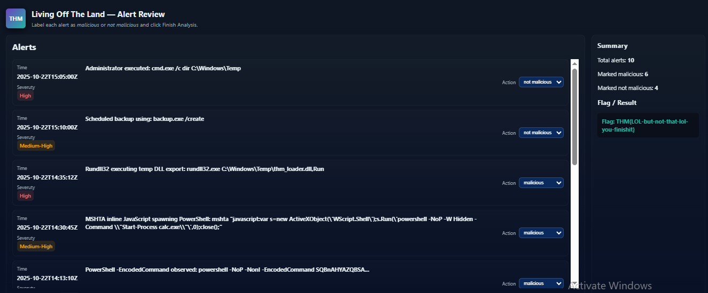
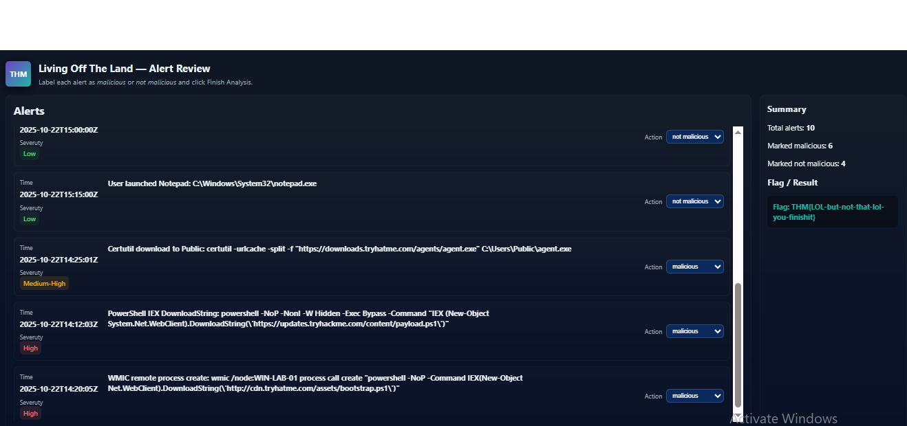

<div align="center">


</div>

## 📖 Room Overview

Living Off the Land Attacks is an easy SOC Level 1 room that flips the usual malware lesson on its head. Instead of studying custom payloads and dropped executables, it looks at how attackers abuse tools that already ship with Windows. Utilities like PowerShell, WMIC, certutil, mshta, rundll32, and Task Scheduler are trusted, signed by Microsoft, and expected on nearly every host, so when an attacker uses them the activity tends to blend into normal administrative noise.

The room builds up from the basics. It starts by defining what Living Off the Land (LOL) actually means, moves into the specific binaries that get abused and the goals behind them, then grounds it all in real threat-group activity from 2022 to 2024. The heart of the room is the detection task, where you see the exact attacker command lines side by side with the log queries a defender would write to catch them. The whole point, as an analyst, is learning that the process name alone tells you almost nothing. The malicious intent lives in the command-line arguments and the process tree, so that is where you have to look.

It wraps up with a practical alert-classification exercise on a live web app, where correctly triaging the alerts hands you the flag.

# 🧭 Task 1: Introduction

## Concept

This task sets the stage. Living Off the Land, often shortened to LOL or LOLBins, describes attackers using legitimate, pre-installed system tools to do their dirty work rather than bringing their own malware. The advantage is stealth. A defender expects to see `powershell.exe` and `certutil.exe` running on a Windows box, so those processes rarely trigger an alert on their own. By riding on trusted binaries, attackers avoid dropping obvious files, dodge some application-control policies, and buy themselves more time before anyone notices.

The task lays out the room's goals: understand what LOL attacks are, learn which Windows tools get abused, recognise the techniques that hide inside normal operations, and practise detecting that behaviour through logs and SIEM alerts.

There is no question to answer here beyond clicking through to begin.

# 🧰 Task 2: Common LoL Tools and Techniques

## Concept

Attackers reach for built-in tools because they are trusted, already present, and usually permitted by default controls. That lets them run code without dropping new binaries, chain small steps together, and reuse legitimate credentials, all of which keeps the noise down. The tools that get abused map neatly onto attacker needs: scripting and automation, remote management, file handling, and scheduling, which translate into execution, persistence, reconnaissance, and lateral movement.

The usual lineup is PowerShell for in-memory scripting and remote downloads, WMIC/WMI for running commands locally or remotely, certutil for fetching and encoding or decoding files, mshta for running HTA or inline script content, rundll32 for invoking DLL exports, and schtasks for persistence via scheduled tasks. The room also flags the Sysinternals suite, since signed admin tools like PsExec and Autoruns get borrowed by attackers too.

Two public catalogs document all of this: LOLBAS for Windows binaries and GTFOBins for Unix and Linux binaries. On the defensive side, the task recommends layered controls, application allow-listing with AppLocker or WDAC, least privilege on management utilities, DNS and network filtering, containment playbooks, and regular review of logging coverage.

**Which public site lists Unix/Linux native binaries and how they can be abused?**

GTFOBins

> How I got the answer: The task explicitly pairs the two abuse catalogs, LOLBAS for Windows and GTFOBins for Unix/Linux. Since the question specifies Unix/Linux native binaries, the matching project is GTFOBins.

**Which Microsoft toolset includes PsExec and Autoruns, used for admin tasks and often misused by attackers?**

Sysinternals

> How I got the answer: The task calls out signed admin utilities from the Sysinternals suite, naming PsExec for remote execution and Autoruns for persistence discovery. Both tools listed in the question belong to Sysinternals.

# 🌍 Task 3: Real-World Examples

## Concept

This task shows that LOL techniques are not just theory, they are a staple of organised threat groups, both state-sponsored and financially motivated, because trusted binaries generate fewer alerts and are harder to block.

APT29 (Nobelium) combined PowerShell with WMI event subscriptions to persist and execute code with almost no on-disk footprint. The payload lived inside WMI properties, then got read, decrypted, and run from there, which is about as fileless as it gets. BlackCat/ALPHV ransomware operators leaned on PowerShell for scripting and disabling defences, PsExec for remote execution and lateral movement, and certutil for pulling down or decoding payloads. And loaders such as QakBot and IcedID have used signed binaries like rundll32 and mshta to bootstrap Cobalt Strike beacons in memory, so the execution looks like it involves legitimate processes.

| Threat Actor | Primary LOL Tools | Purpose |
|---|---|---|
| APT29 (Nobelium) | PowerShell + WMI event subscriptions | Fileless persistence and execution |
| BlackCat / ALPHV | PowerShell, PsExec, certutil | Lateral movement, defence evasion, payload handling |
| QakBot / IcedID loaders | rundll32, mshta | Staging and launching Cobalt Strike beacons |

**What MITRE technique ID covers WMI event subscriptions?**

T1546.003

> How I got the answer: The APT29 section links the WMI event subscription technique directly to its MITRE ATT&CK entry, which documents adversaries creating filters, consumers, and bindings to trigger code on events. That entry is T1546.003.

**Which abbreviated name refers to one of the services that C2s, like Cobalt Strike, use to start or listen for remote services?**

C2

> How I got the answer: The Cobalt Strike section frames these loaders as delivering beacons that call back to attacker infrastructure. The abbreviated term the room uses for that command-and-control channel is C2.

# 🔍 Task 4: Detecting LOL Activity

## Concept

This is where the room gets practical about detection. It walks through each abused binary, shows the kind of command line an attacker would actually run, then pairs it with a Splunk-style query a defender would use to catch it. The recurring lesson is that the binary name looks innocent every time, so detection has to key off the arguments, the parent process, and the process tree rather than the executable itself.

PowerShell is the flagship offender. Attackers use it to run scripts straight in memory, pulling a remote script with the WebClient `DownloadString` method and piping it into `IEX`, or hiding the whole thing behind `-EncodedCommand` so a quick glance at the logs reveals nothing. WMIC gets used as a remote launcher, telling a target host to spin up a new process, and for recon by querying running processes across machines. Certutil, meant for certificate work, doubles as a downloader and a base64 encoder/decoder, letting an attacker smuggle a binary in as text and rebuild it on the host. Mshta runs HTA files or inline JavaScript that can spawn PowerShell. Rundll32 invokes exported functions from DLLs sitting in writable locations. And Task Scheduler creates benign-looking tasks like "WindowsUpdate" that quietly re-launch payloads at logon or on a schedule.

Here is how the process names map to the tell-tale signals a defender should hunt for:

| Tool | Legitimate Purpose | Malicious Tell in the Command Line |
|---|---|---|
| PowerShell | Admin scripting and automation | `DownloadString`, `IEX`, `-EncodedCommand`, `-Exec Bypass`, `-W Hidden` |
| WMIC | System management, local and remote | `process call create`, `/node:` targeting a remote host |
| Certutil | Certificate management | `-urlcache -split -f` for downloads, `-decode` / `-encode` |
| Mshta | Runs HTA applications | Remote `.hta` URL or inline `javascript:` |
| Rundll32 | Executes DLL exports | DLLs in `\Users\Public\` or `\Windows\Temp\`, `url.dll,FileProtocolHandler` |
| Schtasks | Scheduled automation | `/Create` or `/Run` with benign-sounding task names |

**Which PowerShell switch is used to download text/strings and execute them?**

DownloadString

> How I got the answer: In the PowerShell subsection, the in-memory download pattern uses `(New-Object System.Net.WebClient).DownloadString('...')` piped into IEX to fetch and immediately run a remote script. The method responsible for pulling the text/strings down is DownloadString.

**Which WMIC keyword triggers the creation of a new process on a remote host?**

process call create

> How I got the answer: The WMIC example `wmic /node:TARGETHOST process call create "..."` targets a remote host with `/node:` and spawns a new process. The keyword that actually creates that process is `process call create`.

# 🚩 Task 5: Practical

## Concept

This is the only hands-on task. The target machine hosts a small alert-classification web app. You review the worked example it provides, then triage each alert as malicious or benign using everything Task 4 taught you about spotting bad command lines hiding inside trusted binaries. Get the classifications right and the app returns the flag.

The mindset is exactly the SOC triage loop: for each alert, ignore that the process is a normal Windows tool and read the arguments instead. Encoded or hidden PowerShell, `DownloadString`/`IEX`, certutil pulling a URL or decoding a blob, `wmic ... process call create`, mshta with a `javascript:` or remote `.hta`, rundll32 pointed at a writable temp path, or schtasks creating a sneaky task, those are your malicious ones. Routine admin commands with clean arguments are benign.

## Commands

```bash
# On the target machine's browser, open the alert classification app:
https://10-66-176-111.reverse-proxy.cell-prod-us-east-1c.vm.tryhackme.com

# Review the provided example, then classify every alert as malicious or benign.
# Correctly triaging all alerts reveals the flag.
```

I opened the classification page on the target machine and started with the example so I knew what a correctly labelled alert looked like.



Then I worked through each alert, matching the command lines against the malicious signatures from Task 4. Once everything was labelled correctly, the app returned the flag.



**What is the flag?**

THM{LOL-but-not-that-lol-you-finishit}

> How I got the answer: I opened the alert-classification app on the target host, reviewed the example, then classified each alert by reading its command line for the LOL indicators covered in Task 4 (encoded PowerShell, certutil downloads, `wmic process call create`, mshta/rundll32 abuse, and suspicious schtasks entries). Correctly triaging every alert unlocked the flag shown by the app.

# 🎓 Task 6: Wrapping up

## Concept

The final task recaps the whole room. Trusted Windows utilities, PowerShell, WMIC, certutil, mshta, rundll32, and Task Scheduler, can all be turned toward execution, persistence, lateral movement, and evasion without a single new binary hitting disk. The key defender takeaways are reading full command lines and process trees to separate admin activity from attacker activity, and layering defences with enhanced logging, behavioural detection, and execution control to shrink the space these techniques can operate in.

A click to finish the room and you are done.

## 🧰 Tools Used

| Tool / Technique | Role in This Room |
|---|---|
| PowerShell | In-memory download and execution (`DownloadString`, `IEX`, `-EncodedCommand`) |
| WMIC | Remote process creation and recon (`process call create`) |
| Certutil | File download and base64 encode/decode (`-urlcache`, `-decode`) |
| Mshta | Running HTA files or inline `javascript:` payloads |
| Rundll32 | Invoking DLL exports from writable paths |
| Schtasks | Persistence via scheduled tasks (`/Create`, `/Run`) |
| LOLBAS / GTFOBins | Reference catalogs of abusable native binaries |
| Sysinternals (PsExec, Autoruns) | Signed admin tools abused for execution and persistence |
| SIEM / Splunk-style queries | Detecting LOL activity by command-line and process-tree analysis |

## 👨‍💻 Author

**Sanjish K C**

CompTIA Security+ |MS Cybersecurity Candidate at Webster University | Network Analysis | Nmap | Wireshark | Linux | Former Computer Science Instructor Transitioning into Cybersecurity